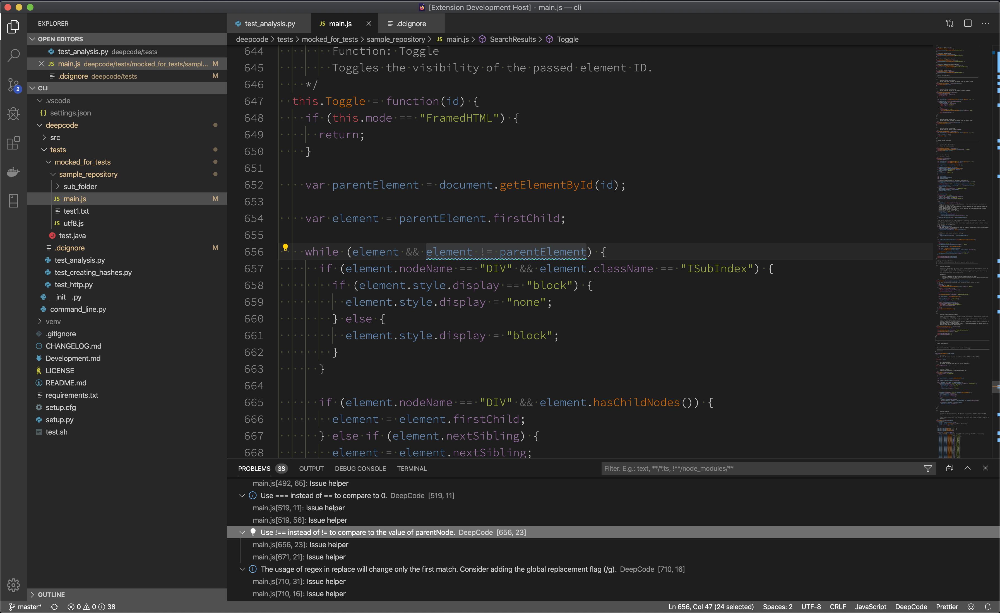
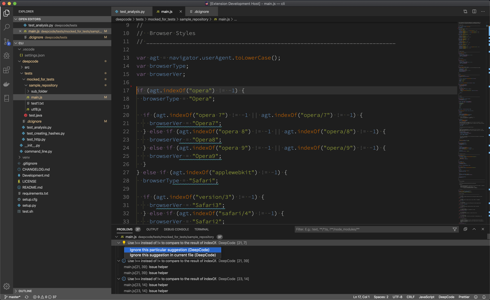
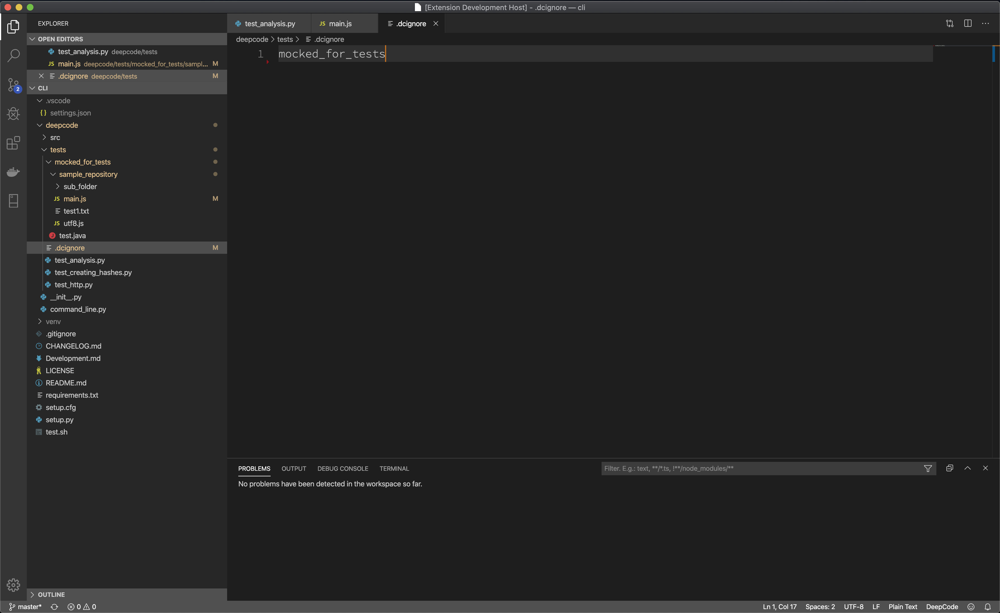

# DeepCode for Visual Studio Code

**The Visual Studio Code extension provided by <a href="https://www.deepcode.ai/">DeepCode.ai</a> finds bugs and critical vulnerabilities in your code. We support JavaScript and TypeScript, Java, C/C++, and Python.**

# Table of Contents

- [DeepCode for Visual Studio Code](#deepcode-for-visual-studio-code)
- [Table of Contents](#table-of-contents)
- [DeepCode extension](#deepcode-extension)
  - [DeepCode's AI Engine finds bugs](#deepcodes-ai-engine-finds-bugs)
  - [Our AI provides explanation behind found bugs](#our-ai-provides-explanation-behind-found-bugs)
  - [Supported languages](#supported-languages)
- [Installation](#installation)
  - [Video on how to install the extension](#video-on-how-to-install-the-extension)
  - [Tips on the installation process](#tips-on-the-installation-process)
- [How to use it?](#how-to-use-it)
  - [PROTIP - DeepCode analysis on Save](#protip---deepcode-analysis-on-save)
  - [Video on how to use the extension](#video-on-how-to-use-the-extension)
  - [DeepCode in action](#deepcode-in-action)
  - [How to ignore suggestions (text)](#how-to-ignore-suggestions-text)
  - [How to ignore suggestions (video)](#how-to-ignore-suggestions-video)
  - [.dcignore file](#dcignore-file)
- [Feedback and contact](#feedback-and-contact)

# DeepCode extension

Through the extension you can quickly start using DeepCode's code review and analysis within your development workflow. The extension will automatically alert you about critical vulnerabilities you need to solve in your code the moment when you hit _Save_ in your IDE. With DeepCode's superior code review you save time finding and fixing bugs before they go to production. 

## DeepCode's AI Engine finds bugs

DeepCode uses symbolic AI to process hundreds of millions of commits in open source software projects and learns how to find serious coding issues. Because the platform determines the intent of the code — and not only the syntax mistakes — DeepCode identifies 10x more critical bugs and security vulnerabilities than other tools. 

## Our AI provides explanation behind found bugs

In order to show the detailed explanation of a potential bug, we introduced a new AI technique called _Ontology_. With Ontology, we’ve integrated the capability to present logical argumentation used by the DeepCode engine. 

## Supported languages

JavaScript, TypeScript, Java, C/C++, and Python are currently supported.

# Installation

## Video on how to install the extension

- We've prepared a 2 minutes video on how to install the extension. Head over to YouTube to quickly get the extension up and running:

  

## Tips on the installation process

- select **"Cloud"** when you want to use the free cloud infrastructure. Authentication by your Github, BitBucket or Gitlab account.
- select **"Self-managed"** when you have access to an on-premise DeepCode Server installation. The DeepCode Server is likely running in combination with self-managed BitBucket or Gitlab.

# How to use it?

## PROTIP - DeepCode analysis on Save

- DeepCode's extension runs automatically when you opened a folder or project and hit _Save_ (or the keyboard shortcut).
- If you don't like to save while working we strongly recommend to [enable the AutoSave](https://code.visualstudio.com/docs/editor/codebasics#_save-auto-save).

## Video on how to use the extension

- Here is a video on how to use the extension. In short - don't forget to save and you will be in good hands:

## DeepCode in action 

- Here is how it looks like when inspecting all issues using the "Problems" tab and syntax highlight:

## How to ignore suggestions (text)

There are two key steps here:
    
   1. Ignore particular alert directly within its suggestions tooltip or 'bulb' menu:

   

   1. Deepcode will create a code comment, that will inform our analysis engine to ignore it. Don't forget to specify a description why you think it needs to be ignored.

   

## How to ignore suggestions (video)

- If the above information is not enough and want to see it in action, here is a video:

## .dcignore file 

- If you want to ignore certain files/folders (like *node_modules* for example), create a _.dcignore_ file. You can create it in any folder on any level starting from the directory where your project resides. The file syntax is identical to _.gitignore_:

# Feedback and contact

- In case you need to contact us or you want to provide feedback, we love to hear from you - [here is how to get in touch with us](https://www.deepcode.ai/feedback).
- If you need to update this file, you can do so by [editing this README.md](https://github.com/DeepCodeAI/vscode-extension/edit/master/README.md).