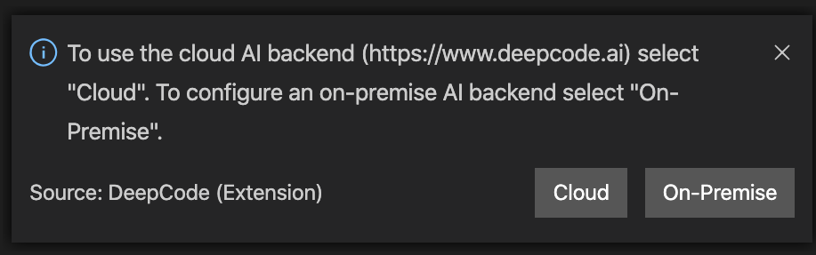
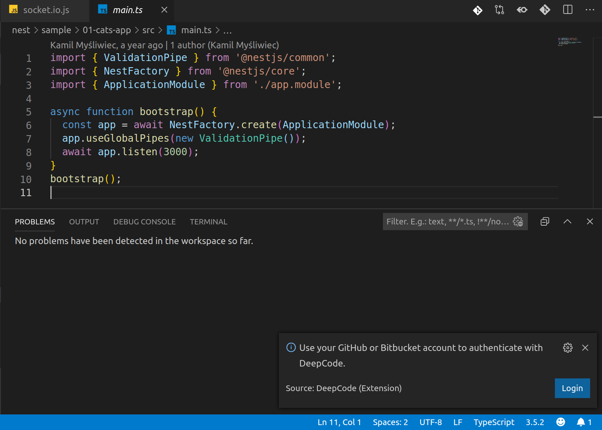
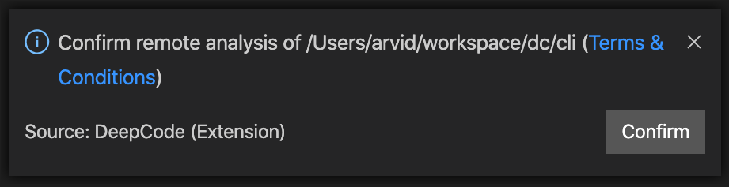

**The Visual Studio Code extension provided by <a href="https://www.deepcode.ai/">DeepCode.ai</a> finds bugs and and critical vulnerabilities in your code. We support Java, Python, JavaScript, TypeScript and XML.**

# Table of Contents

1. [DeepCode extension - what is it?](#deepcode-extension)
2. [Installation](#installation)
3. [How it works?](#how-it-works)

# DeepCode extension

Through the extension you can quickly start using DeepCode's code review and analysis within your development workflow. The extension will automatically alert you about critical vulnerabilities you need to solve in your code the moment when you hit Save in your IDE. With DeepCode's superior code review you save time finding and fixing bugs before they go to production. 

## DeepCode's AI Engine finds bugs

DeepCode uses symbolic AI to process hundreds of millions of commits in open source software projects and learns how to find serious coding issues. Because the platform determines the intent of the code — and not only the syntax mistakes — DeepCode identifies 10x more critical bugs and security vulnerabilities than other tools. 

## Our AI provides explanation behind found bugs

In order to show detailed explanation why something was flagged as bug we introduced a new AI technique called Ontology. With Ontology, we’ve integrated the capability to present logical conclusions within the DeepCode engine. 

## Supported languages

Java, JavaScript, Python, TypeScript and XML are currently supported. C/C++ support is coming soon.

# Installation

- We've prepared a nice video on how to install the extension. Head over to youtube to quickly get the extension up and running:

# How it works

Select desired environment between Cloud and Self-managed:

Login Deepcode extension using your Bitbucket.org, Github.com or GitLab.com account:

Confirm uploading your code to DeepCode server. Your code is protected and used only for the purpose of informing you about issues in code:

DeepCode extension analyses your code:

Inspect all found issues using "Problems" tab and syntax highlight:

Ignore certain files/folders, by adding a file .dcignore to any folder. The file syntax is identical to .gitignore:

Ignore particular alert directly within its suggestions tooltip or 'bulb' menu:

Deepcode will create a comment, that will inform analysis engine to ignore it. Don't forget to specify a description why you think it needs to be ignored. Your feedback will improve our engine over time:

