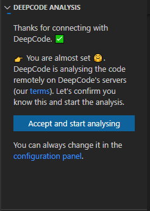
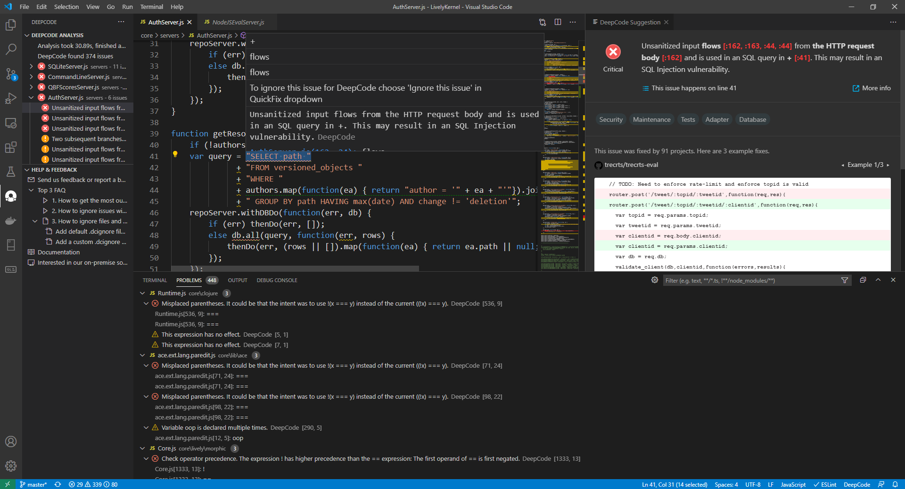
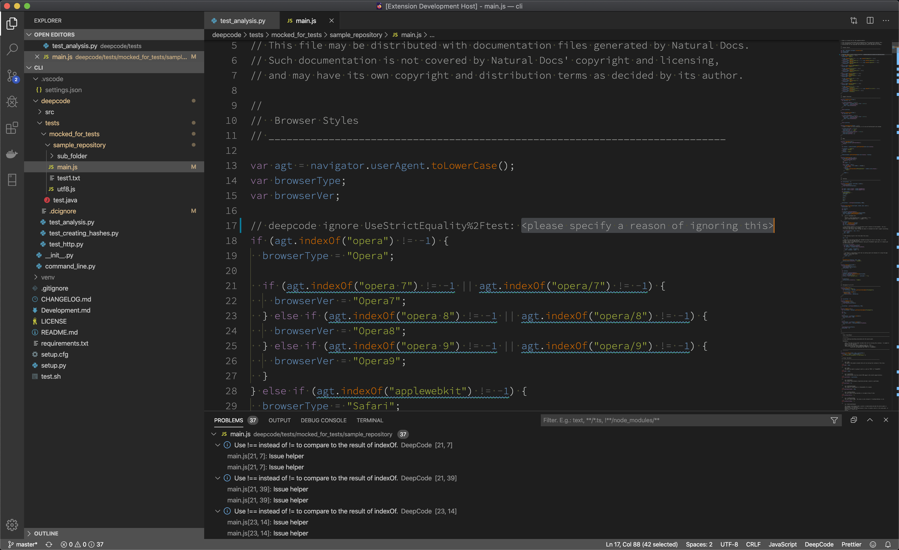

# Snyk for Visual Studio Code

**The Visual Studio Code extension provided by <a href="https://snyk.io/">Snyk.io</a> finds bugs and critical vulnerabilities in your code. We support JavaScript and TypeScript, Java.**

# Table of Contents

- [Snyk for Visual Studio Code](#snyk-for-visual-studio-code)
- [Table of Contents](#table-of-contents)
- [Snyk Extension](#snyk-extension)
  - [Snyk's AI Engine finds bugs](#Snyk-ai-engine-finds-bugs)
  - [Our AI provides explanation behind found bugs](#our-ai-provides-explanation-behind-found-bugs)
  - [Supported languages](#supported-languages)
  - [Video on how to install and use the extension](#video-on-how-to-install-and-use-the-extension)
- [Installation](#installation)
  - [Tips on the installation process](#tips-on-the-installation-process)
- [How to use it?](#how-to-use-it)
  - [PROTIP - Snyk analysis on Save](#protip---snyk-analysis-on-save)
  - [Video on how to use the extension](#video-on-how-to-use-the-extension)
  - [Snyk in action](#snyk-in-action)
  - [How to ignore suggestions (text)](#how-to-ignore-suggestions-text)
  - [How to ignore suggestions (video)](#how-to-ignore-suggestions-video)
  - [.dcignore file](#dcignore-file)
- [Feedback and contact](#feedback-and-contact)

# Snyk Extension

Through the extension you can quickly start using Snyk's code review and analysis within your development workflow. The extension will automatically alert you about critical vulnerabilities you need to solve in your code the moment when you hit _Save_ in your IDE. With Snyk's superior code review you save time finding and fixing bugs before they go to production.

## Snyk's AI Engine finds bugs

Snyk uses symbolic AI to process hundreds of millions of commits in open source software projects and learns how to find serious coding issues. Because the platform determines the intent of the code — and not only the syntax mistakes — Snyk identifies 10x more critical bugs and security vulnerabilities than other tools.

## Our AI provides explanation behind found bugs

In order to show the detailed explanation of a potential bug, we introduced a new AI technique called _Ontology_. With Ontology, we’ve integrated the capability to present logical argumentation used by the Snyk engine. If you want to learn more about the technologies behind Snyk, make sure to visit our website [Snyk.io](https://snyk.io) and the resources listed.

## Supported languages

JavaScript, TypeScript, Java are currently supported. We also provide specific coverage for VUE and REACT.

## Video on how to install and use the extension

- We've prepared a short video on how to install and use the extension. Head over to YouTube to quickly get the extension up and running:

  

# Installation

You can find the Snyk Extension in the Visual Studio Code Marketplace. So, to install, you can either navigate to the [Snyk Extension on the Visual Studio Code Marketplace](https://marketplace.visualstudio.com/items?itemName=Snyk.snyk) and press _Install_ or use the build in mechanism in Visual Studio Code behind the _Extensions Icon_  in the sidebar.

# How to use it?

## PROTIP - Snyk analysis on Save

- Snyk's extension runs automatically when you opened a folder or project and hit _Save_ (or the keyboard shortcut).
- If you don't like to save while working we strongly recommend to [enable the AutoSave](https://code.visualstudio.com/docs/editor/codebasics#_save-auto-save).
- In the configuration of the extension, you can enable _Advanced Mode_ which enables you to manage the scanning process even better.

## Snyk in action

Whenever Snyk encounters an unseen project, you will be asked to provide consent for Snyk to handle the code. Without the consent, Snyk will not touch your code.

Snyk will then bundle the files and run an analysis. From Extension Version 3.x on, you can find a Snyk Icon in the sidebar . It provides all the suggestions in a concise and clean view containing all information that is available on the online dashboard.

On the top left, you can see some statistics plus a list of files with the suggestions found for them. The icons here mean:
-  Critical suggestion which should be addressed
-  Warning suggestion which seems to be a coding error
-  Information suggestion which points to style glitches or logical issues

Below, on the bottom left, you see a collection of helpful links about Snyk.

In the middle, you can see the editor window showing the code that is inspected and below the _Problems_ window. These two provide syntax highlightning and context to the suggestion you are currently inspecting.

On the top right, you see the _Snyk Suggestion_ window. It provides the argumentation of the Snyk engine using for example variable names of your code and the line numbers in red. Also, here you can find links to external resources to explain the bug pattern in more detail (see the _More info_ link). Furthermore, you can see tags that were assigned by Snyk such as _Security_ (this is an security issue), _Database_ (it is related to database interaction), or _In Test_ (it seems it is test code) to name a few. Moreover, you can see code from open source repositories that might be of help to see how others got rid of the issue at hand. Finally, you can insert the comments that command Snyk to ignore this particular suggestion or all of these suggestions for the whole file by using the two buttons on the lower end of the window. You want to do this in the case that you know what you are doing or it is testing code that explicitly does something wrong.

We also want to mention that we included the feedback mechanism for possible false positive in the same way as you know it from the web based dashboard.

## How to ignore suggestions (text)

There are two key steps here:

   1. Ignore particular alert directly within its _Snyk Suggestion_ window as mentioned above, the suggestions tooltip or 'bulb' menu:

   

   1. Snyk will create a code comment, that will inform our analysis engine to ignore it. Don't forget to specify a description why you think it needs to be ignored.

   

## How to ignore suggestions (video)

- If the above information is not enough and want to see it in action, here is a video:

## .dcignore file

- If you want to ignore certain files/folders (like *node_modules* for example), create a _.dcignore_ file. You can create it in any folder on any level starting from the directory where your project resides. The file syntax is identical to _.gitignore_:

# Feedback and contact

- We listed feedback channels and more information resources in the window on the lower left of the Snyk dashboard in Visual Studio Code.
- In case you need to contact us or you want to provide feedback, we love to hear from you - [here is how to get in touch with us](https://snyk.io/contact-us/).
- If you need to update this file, you can do so by [editing this README.md](https://github.com/snyk/vscode-extension/edit/master/README.md).
