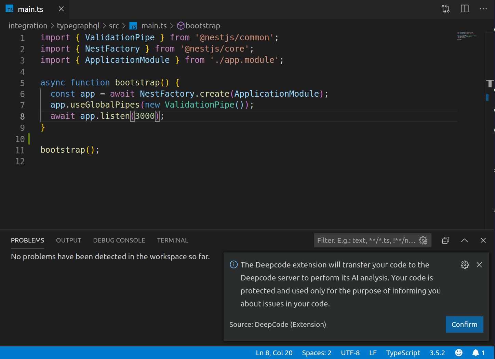

# DeepCode extension

<h3>
VS Code extension provided by <a href="https://www.deepcode.ai/">DeepCode.ai</a> to detect important bugs and issues in your code. Supports Java, Python, JavaScript, TypeScript and XML
</h3>
<h3>
DeepCode's AI algorithms continuously learn from bugs and issues fixed on open source
repos. The extension will automatically alert you about critical vulnerabilities you need to solve
in your code every time you save a file. Don't let security bugs go to production. Save time
finding and fixing them.
</h3>

# How it works

Login Deepcode extension using your Bitbucket or Github account:

Confirm uploading your code to DeepCode server. Your code is protected and used only for the purpose of informing you about issues in code:

DeepCode extension analyses code on saving files:

Inspect all found issues using "Problems" tab and syntax highlight:

