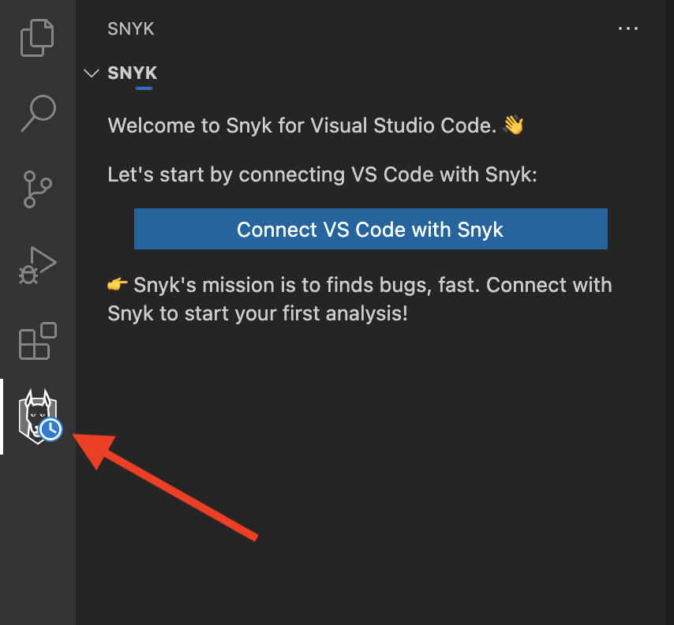
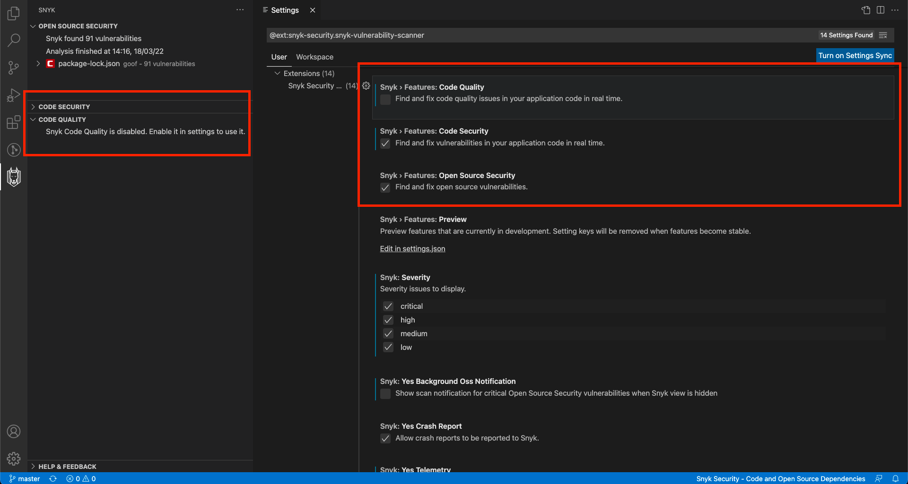
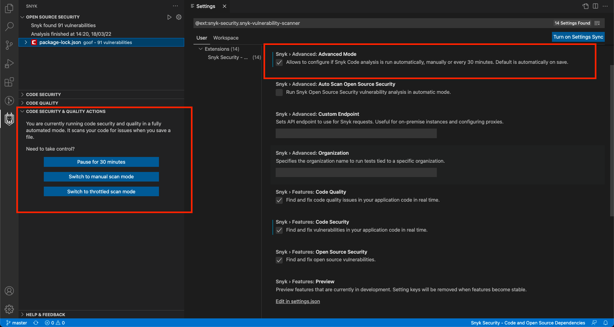

# Snyk for Visual Studio Code

Snyk Security - Code and Open Source Dependencies extension provided by <a href="https://snyk.io/">Snyk.io</a> helps you find and fix security vulnerabilities and code quality issues in your projects. Within a few seconds, the extension will provide a list of all the different types of issues identified, together with actionable fix advice:

- **Open Source Security** - known vulnerabilities in both the direct and in-direct (transitive) open source dependencies you are pulling into the project.
- **Code Security** - security weaknesses identified in your own code.
- **Code Quality** - code quality issues in your own code.

**Snyk detects the critical vulnerability Log4Shell ([CVE-2021-44228](https://security.snyk.io/vuln/SNYK-JAVA-ORGAPACHELOGGINGLOG4J-2314720)), which was found in the open source Java library log4j-core - a component of one of the most popular Java logging frameworks, Log4J. The vulnerability was categorized as Critical with a CVSS score of 10, and with a mature exploit level.**

## Table of Contents

- [Introduction](#introduction)
  - [Supported languages](#supported-languages)
- [Install the extension](#install-the-extension)
- [Authentication](#authentication)
- [Run analysis](#run-analysis)
  - [Rescan](#rescan)
  - [Snyk Code advanced mode](#snyk-code-advanced-mode)
- [View analysis results](#view-analysis-results)
  - [Snyk panel](#snyk-panel)
  - [Editor window](#editor-window)
  - [Snyk Code vulnerability window](#snyk-code-vulnerability-window)
  - [Snyk OSS vulnerability window](#snyk-oss-vulnerability-window)
- [Extension Configuration](#extension-configuration)
  - [Create a .dcignore file](#create-a-dcignore-file)

## Introduction

Use this documentation to get started with the Visual Studio Code extension for [Snyk Code](https://docs.snyk.io/products/snyk-code) and [Snyk Open Source](https://docs.snyk.io/products/snyk-open-source).

### Supported languages

#### Snyk Code

Currently supported languages for Snyk Code are JavaScript, TypeScript, Java, Python and C#. We also provide coverage for frameworks
like Vue and React. See [Snyk Code language and framework support](https://docs.snyk.io/products/snyk-code/snyk-code-language-and-framework-support)
for more information. We analyze files as defined by the following list: `aspx`, `CS`, `ejs`, `.es`, `.es6`, `.htm`, `.html`, `.js`, `.jsx`, `.ts`, `.tsx`, `.vue`, `.py`, `.java`.

#### Snyk Open Source

As the open source vulnerability scanning is based on Snyk CLI, for Snyk Open Source the extension supports all the ecosystems that are supported within the CLI.
For the full list see [Snyk Open Source language and package manager support](https://docs.snyk.io/products/snyk-open-source/language-and-package-manager-support).

## Install the extension

You can find the [Snyk Extension](https://marketplace.visualstudio.com/items?itemName=snyk-security.snyk-vulnerability-scanner) in the Visual Studio Code Marketplace. To install, either:

- Navigate to the [Snyk Extension on the Visual Studio Code Marketplace](https://marketplace.visualstudio.com/items?itemName=snyk-security.snyk-vulnerability-scanner)
  and follow the instructions for the Snyk extension. The docs from VS Code help you trigger the installation process
  from Visual Studio Code and guide you through the installation steps.
- Browse for the extension as advised [here](https://code.visualstudio.com/docs/editor/extension-gallery#_browse-for-extensions)
  and search for Snyk, then install (as described [here](https://code.visualstudio.com/docs/editor/extension-gallery#_install-an-extension)).

Once installed you can find a Snyk icon in the sidebar .

Snyk’s extension provides all the suggestions in a concise and clean view containing all information you need to decide
how to fix or act upon:

## Configuration

### Environment

To analyse projects, the plugin uses the Snyk CLI which needs some environment variables. The following variables are needed or helpful, dependent on the type of project you analyse:

- `PATH` should contain the path to needed binaries, e.g. to maven, gradle, python, go.
- `JAVA_HOME` should contain the path to the JDK you want to use for analysis of Java dependencies

Setting these variables only in a shell environment via e.g. `~/.bashrc` is not sufficient, if you don't start the vscode from the command line or create a script file that starts it using a shell environment.

- On **Windows**, you can set the variables, using the GUI or on the command line using the `setx` tool.
- On **macOS**, the process `launchd` needs to be aware of the environment variables if you want to launch the IDE from Finder directly. You can set environment variables for applications launched via Finder using the `launchctl setenv` command e.g. on start-up or via a script you launch at user login. The provision of environment variables to the macOS UI is sometimes changing between operating system releases, so it might be easier to create a small shell script that launches the IDE to leverage the shell environment, that can be defined via `~/.bashrc`.
- On **Linux**, updating the file `/etc/environment` can be used to propagate the environment variables to the windows manager and UI.

### Proxy

If you are behind proxy, proxy settings need to be configured either using VS Code proxy settings or set using `http_proxy` and `https_proxy` environment variables.

## Authentication

The extension uses your Snyk API token for authentication. To store the token securely, we utilize [Secret Storage API](https://code.visualstudio.com/api/references/vscode-api#SecretStorage), which uses the system's keychain to manage the token.

### Logging in

To authenticate follow the steps:

1. Once the extension is installed, click on the Snyk Icon in the left navigation bar, to show the following screen:
   

2. Click **Connect VS Code with Snyk**. The extension relies on the Snyk authentication API and it will ask you
   to authenticate you against Snyk’s web application:
   

3. Click **Authenticate**.
4. After successful authentication, you will see a confirmation message:
   

5. Close the browser window and return to VS Code.
   VS Code is now reading and saving the authentication on your local machine.

### Switching accounts

To re-authenticate with a different account, follow the steps below:

1. Run the provided `Snyk: Log Out` command:

   

2. Once logged out, click [**Connect VS Code with Snyk**](#logging-in) to authenticate
   with the different account.
3. Or you run `Snyk: Set Token` command and set your token in the text field manually.

   

## Run analysis

In the IDE you will notice that the extension is already picking up the files and uploading them for analysis.

Snyk Open Source requires Snyk CLI, so it will proceed with the download in the background.

Snyk Code analysis runs quickly without it, so results may even already be available. Otherwise, you will see the following screen while Snyk scans your workspace for vulnerabilities:

Snyk's analysis runs automatically when you open a folder or workspace.

- Snyk Code performs scans automatically on file saves.
- Snyk Open Source does not automatically run on save by default, but you can enable it in settings:
  

**Tip**: if you don't like to manually save while working, enable [AutoSave](https://code.visualstudio.com/docs/editor/codebasics#_save-auto-save).

### Rescan

To manually trigger a scan, either Save or manually rescan using the rescan icon:

If you only need the Code Quality, Code Security or Open Source Security portion of the findings, you can easily disable the feature with the results you don't want to see or simply collapse the view:

### Snyk Code advanced mode

Snyk Code has "Advanced" mode that allows you to control how scan is performed.

To manually perform the analysis, in the configuration of the extension, you can enable Advanced Mode which enables you to control the scanning process:

## View analysis results

Snyk analysis shows a list of security vulnerabilities and code issues found in the application code. For more
details and examples of how others fixed the issue, select a security vulnerability or a code security issue. Once
selected you will see the Snyk suggestion information in a panel on the right side:

### Snyk panel

The Snyk analysis panel (on the left of the code screen in the above screenshot) shows how much time the analysis took
plus a list of issues with the suggestions found for them.

The icons here mean:

-  Critical severity - may allow attackers to access sensitive data and run code on your application.
-  High severity - may allow attackers to access sensitive data on your application.
-  Medium severity - may allow attackers under some conditions to access sensitive data on your application.
-  Low severity - the application may expose some data allowing vulnerability mapping, which can be used with other vulnerabilities to attack the application.

You can filter the issues by setting the severities you want to see using the `snyk.severity` setting. E.g. set `"snyk.severity": { "critical": true, "high": true, "medium": true, "low": false }` to hide low severity issues. You can also apply the setting via Settings UI.

### Snyk Code editor window

The editor window (in the middle of the results screen) shows the code that is inspected. This ensures that when you are
inspecting a Snyk issue, you always have the code context close to the issue.

### Snyk Code vulnerability window

The Snyk Suggestion panel (on the right of the results screen) shows the argumentation of the Snyk engine using for
example variable names of your code and the line numbers in red. You can also see:

- Links to external resources to explain the bug pattern in more detail (the **More info** link).
- Tags that were assigned by Snyk, such as **Security** (the issue found is a security issue), **Database** (it is
  related to database interaction), or **In Test** (the issue is within the test code).
- Code from open source repositories that might be of help to see how others fixed the issue.
- You can add ignore comments that would make Snyk ignore this particular suggestion, or all of these suggestions for
  the whole file, by using the two buttons on the lower end of the panel.

We also include a feedback mechanism to report false positives so that others do not see the same issue.

### Snyk Open Source editor window

Editor window shows security vulnerabilities in open source modules while you code in JavaScript, TypeScript and HTML. Receive feedback in-line with your code, such as how many vulnerabilities a module contains that you are importing. Editor surfaces only top-level dependency vulnerabilities, for the full list of vulnerabilities refer to the side panel.

- Find security vulnerabilities in the npm packages you import: see the number of known vulnerabilities in your imported npm packages as soon as you require them:
  
- Code inline vulnerability counts are also shown in your `package.json` file:
  
- Find security vulnerabilities in your JavaScript packages from well-known CDNs: the extension scans any HTML files in your projects and displays vulnerability information about the modules you include from your favorite CDN.

  - Currently supported CDN's:
    - unpkg.com
    - ajax.googleapis.com
    - cdn.jsdelivr.net
    - cdnjs.cloudflare.com
    - code.jquery.com
    - maxcdn.bootstrapcdn.com
    - yastatic.net
    - ajax.aspnetcdn.com

  

You can navigate to the most severe vulnerability by triggering the provided code actions. This opens [a vulnerability window](#snyk-open-source-vulnerability-window) to show more details:

### Snyk Open Source vulnerability window

OSS vulnerability tab shows information about the vulnerable module.

- Links to external resources (CVE, CWE, Snyk Vulnerability DB) to explain the vulnerability in more detail.
- Displays CVSS score and [exploit maturity](https://docs.snyk.io/features/fixing-and-prioritizing-issues/issue-management/evaluating-and-prioritizing-vulnerabilities).
- Provides a detailed path on how vulnerability is introduced to the system.
- Shows summary of the vulnerability together with the remediation advice to fix it.

## Extension Configuration

After the extension is installed, you can set the following configurations for the extension:

- **Features**
  - **Code Security**: configures if code security analysis should run over your code.
  - **Code Quality**: configures if code quality analysis should run over your code.
  - **Open Source Security**: configures if security analysis should run over your open source dependencies.
- **Severity**: sets severity level to display in the analysis result tree.
- **Advanced**
  - **Advanced mode**: toggles a panel to allow the user to manually control when the analysis should be run.
  - **Auto Scan Open Source Security**: sets severity level to display in the analysis result tree.
  - **Additional Parameters**: sets parameters to be passed to Snyk CLI for Open Source Security tests. For the full list you can consult [this reference](https://docs.snyk.io/features/snyk-cli/cli-reference).

### Create a .dcignore file

To ignore certain files and directories (for example, **node_modules**), create a **.dcignore** file. You can create it
in any directory on any level starting from the directory where your project resides. The file syntax is identical
to .gitignore.

- We recommend adding the file when there is no **.gitignore** file. This will significantly reduce the files that need
  to be uploaded and speed up the analysis.
- To quickly add the default **.dcignore** file use the command provided by VS Code and the Snyk extension: Snyk create
  .dcignore file and save the newly created .dcignore file.
