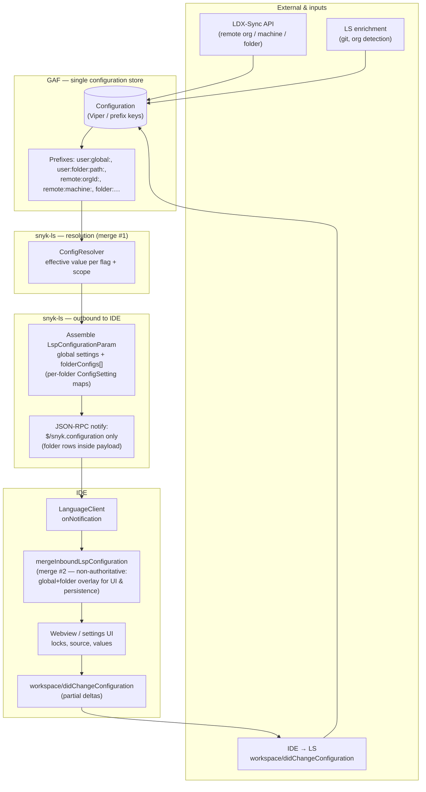

# Configuration: GAF → snyk-ls → IDE

High-level flow for how settings are stored in GAF, resolved in **snyk-ls**, pushed to IDEs, and how **merges** relate to the **VS Code** extension (`mergeInboundLspConfiguration`, IDE-1638). The language server delivers effective config (including per-folder rows) on **`$/snyk.configuration`** as **`LspConfigurationParam`**; the VS Code client does **not** subscribe to the legacy **`$/snyk.folderConfigs`** notification.

## Diagram

Source (editable): [`docs/diagrams/configuration-gaf-ls-ide-flow.mmd`](diagrams/configuration-gaf-ls-ide-flow.mmd).

## Where merges happen

| # | Location | What is merged |
|---|----------|----------------|
| **1** | **snyk-ls / GAF / `ConfigResolver`** | Prefix layers (`user:global`, `user:folder`, `remote:*`, defaults) → **authoritative** effective value per setting, folder, and org. This is the real precedence chain (see snyk-ls `docs/configuration.md` when present). |
| **2** | **LS outbound** | Builds **`LspConfigurationParam`**: global `settings` map + per-folder `folderConfigs[].settings` with **`ConfigSetting`** (`value`, `source`, `originScope`, `isLocked`). Already reflects resolver output. |
| **3** | **IDE (VS Code) — `mergeInboundLspConfiguration`** | **Not a second `ConfigResolver`**: shallow **`global ∪ folder`** overlay of one inbound payload into **`MergedLspConfigurationView`** for webview and persistence mappers. Does **not** re-run GAF precedence or override LS authority; LS keys match LS. |
| **4** | **VS Code — outbound `folderConfigs` (init + `workspace/didChangeConfiguration`)** | **`LanguageServerSettings.resolveFolderConfigsForServerSettings`**: use **`IConfiguration.getFolderConfigs()`** when non-empty; if empty and the workspace has folders, **`synthesizeFolderConfigsFromWorkspace`**. Feeds **`LanguageServerSettings.fromConfiguration`** → **`serverSettingsToLspConfigurationParam`**. |
| **—** | **`$/snyk.configuration` (inbound)** | Carries **`LspConfigurationParam`**: global **`settings`** plus optional **`folderConfigs[]`** (per-folder paths and **`settings`** maps). VS Code merges with **`mergeInboundLspConfiguration`** for **UI + persistence** (see **#3**). **VS Code does not register** the legacy **`$/snyk.folderConfigs`** notification. |

## Round trip

- **LS → IDE:** `$/snyk.configuration` pushes effective state (and locks); **`mergeInboundLspConfiguration`** shapes it for **UI and persistence** (still **not** authoritative vs merge #1).
- **LS → `settings.json` (VS Code, optional):** `ConfigurationPersistenceService.persistInboundLspConfiguration` maps the global snapshot into VS Code settings. While inbound persistence is running, explicit key marking is suppressed (`suppressExplicitKeyMarkingFromInboundPersistence`) so LS-originated writes are not mistakenly recorded as user overrides.
- **IDE → LS (pull model):** `synchronize.configurationSection` triggers **`workspace/didChangeConfiguration`** with a flat VS Code settings payload whenever the `snyk` section changes. snyk-ls cannot parse this flat payload as **`LspConfigurationParam`**, so it falls back to the **pull model**: snyk-ls sends a **`workspace/configuration`** request, and the **`LanguageClientMiddleware`** responds with **`[{ settings: LspConfigurationParam }]`** — structured config with proper **`changed`** flags. Only settings marked as **explicitly changed** by the user (tracked via **`ExplicitLspConfigurationChangeTracker`**) have **`changed: true`**; all others have **`changed: false`** so snyk-ls does not treat them as user overrides.

### VS Code Language Client: pull model with structured response

The extension sets **`synchronize.configurationSection`** to `'snyk'`. When the user changes a VS Code setting under the `snyk` section, vscode-languageclient automatically sends **`workspace/didChangeConfiguration`** with a flat settings payload. snyk-ls receives this, cannot deserialize it as **`LspConfigurationParam`**, and falls through to the **pull model** — issuing a **`workspace/configuration`** request back to the IDE.

The **`LanguageClientMiddleware`** intercepts this request and builds a structured **`LspConfigurationParam`** response via **`serverSettingsToLspConfigurationParam`**, using **`ExplicitLspConfigurationChangeTracker.isExplicitlyChanged()`** to set the **`changed`** flag on each setting. The middleware returns **`[{ settings: <LspConfigurationParam> }]`** (matching the **`[]DidChangeConfigurationParams`** shape snyk-ls expects).

**Explicit key tracking:** After the language client starts, **`LanguageServer`** registers **`workspace.onDidChangeConfiguration`** to mark which LS keys the user has explicitly changed (via **`markExplicitLsKeysFromConfigurationChangeEvent`**). This marking is suppressed while **`foldersBeingUpdatedByLS`** is non-empty or during inbound persistence, to avoid recording LS-originated changes as user overrides.

### IDE → LS outbound requirements (`LspConfigurationParam`)

When the IDE sends updates (including from VS Code settings or the workspace configuration UI), each touched setting in the outbound payload must follow these rules:

- **`changed`:** Set **`changed: true`** for any setting the user has **explicitly modified** (not for values the IDE merely echoes without a user edit).
- **`value`:** Provide the **new value** in the **`value`** field when the user sets or overrides a value.

**Resetting to default**

- To clear a user override and revert to the default (or remote) value, send the setting with **`changed: true`** and **`value: null`**.

**Global vs folder overrides**

- If the user changes a setting **globally** (for the whole IDE), place it in the **root** `settings` map (LS-keyed entries with `ConfigSetting` shape).  
  - If an **org-scoped** setting is changed globally, the LS will **automatically clear** any folder-specific overrides for that setting.
- If the user changes a setting **for a specific workspace folder**, place it in the **`settings`** map inside the matching **`folderConfigs[]`** entry (the entry whose `folderPath` matches that folder).

## Workspace configuration webview (VS Code)

HTML is served by **snyk-ls** (or the extension fallback). The extension injects a script that listens for `inboundLspConfiguration` and applies **`isLocked`**, **`source`**, and **`originScope`** to controls that follow this DOM convention:

- **Global effective keys:** elements with `data-snyk-setting-key="<LS key name>"` that are **not** inside a `[data-snyk-folder-path]` subtree.
- **Per-folder keys:** elements with `data-snyk-setting-key` under an ancestor (or on the same element) with `data-snyk-folder-path="<absolute folder path>"` matching the merged view’s `folderSettingsByPath` key.

Locked controls get `disabled` (when applicable), class `snyk-lsp-locked`, and optional `aria-readonly`. When `source` or `originScope` is set, a `snyk-lsp-setting-meta` line is inserted after the control.

**Tests (IDE1638-U-002):** `WorkspaceConfigurationWebviewProvider` posts the merged view to the webview (`src/test/integration/workspaceConfigurationWebviewProvider.test.ts`); `HtmlInjectionService` injects the apply helper and message handler (`src/test/unit/common/views/workspaceConfiguration/services/htmlInjectionService.test.ts`).

## References

- snyk-ls (e.g. IDE-1786 / config refactor): `ConfigSetting`, `LspConfigurationParam`, `docs/configuration.md`.
- VS Code extension: `lspConfigurationMerge.ts`, `LanguageServer` inbound view, IDE-1638.
- **Flat IDE settings → `LspConfigurationParam`:** `serverSettingsToLspConfigurationParam.ts` (`serverSettingsToLspConfigurationParam`, `folderConfigToLspFolderConfiguration`) mirrors snyk-ls `legacySettingsToLspConfigurationParam` / LS key names in `internal/types/ldx_sync_config.go`.
