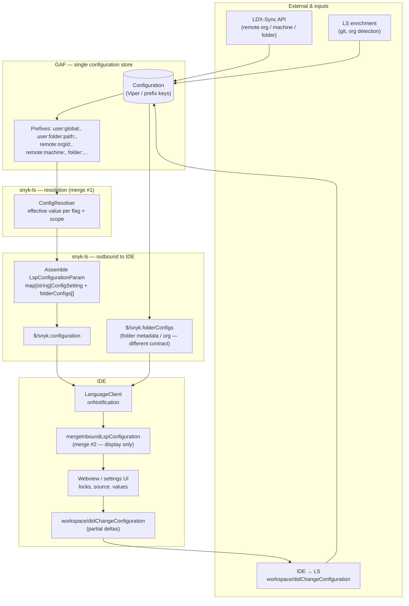

# Configuration: GAF → snyk-ls → IDE

High-level flow for how settings are stored in GAF, resolved in **snyk-ls**, pushed to IDEs, and how **merges** relate to the **VS Code** extension (`mergeInboundLspConfiguration`, IDE-1638).

## Diagram

Source (editable): [`docs/diagrams/configuration-gaf-ls-ide-flow.mmd`](diagrams/configuration-gaf-ls-ide-flow.mmd).

## Where merges happen

| # | Location | What is merged |
|---|----------|----------------|
| **1** | **snyk-ls / GAF / `ConfigResolver`** | Prefix layers (`user:global`, `user:folder`, `remote:*`, defaults) → **authoritative** effective value per setting, folder, and org. This is the real precedence chain (see snyk-ls `docs/configuration.md` when present). |
| **2** | **LS outbound** | Builds **`LspConfigurationParam`**: global `settings` map + per-folder `folderConfigs[].settings` with **`ConfigSetting`** (`value`, `source`, `originScope`, `isLocked`). Already reflects resolver output. |
| **3** | **IDE (VS Code) — `mergeInboundLspConfiguration`** | **Presentation merge only**: spreads global map into each folder’s effective map so the UI can read one object per folder. Does **not** replace LS resolution; must use **same flag keys** as LS (pflag names). |
| **—** | **`$/snyk.folderConfigs` vs `$/snyk.configuration`** | Not the same merge: **folderConfigs notification** carries folder/org **metadata** and related fields; **configuration notification** carries the **map-based effective config** (protocol v25+). Both can land in the IDE; keep contracts separate. |

## Round trip

- **LS → IDE:** `$/snyk.configuration` pushes effective state (and locks) for UI.
- **IDE → LS:** `workspace/didChangeConfiguration` with **`LspConfigurationParam`-shaped** payload; only **changed** keys, `value: null` to clear override (per protocol).

## References

- snyk-ls (e.g. IDE-1786 / config refactor): `ConfigSetting`, `LspConfigurationParam`, `docs/configuration.md`.
- VS Code extension: `lspConfigurationMerge.ts`, `LanguageServer` inbound view, IDE-1638.
