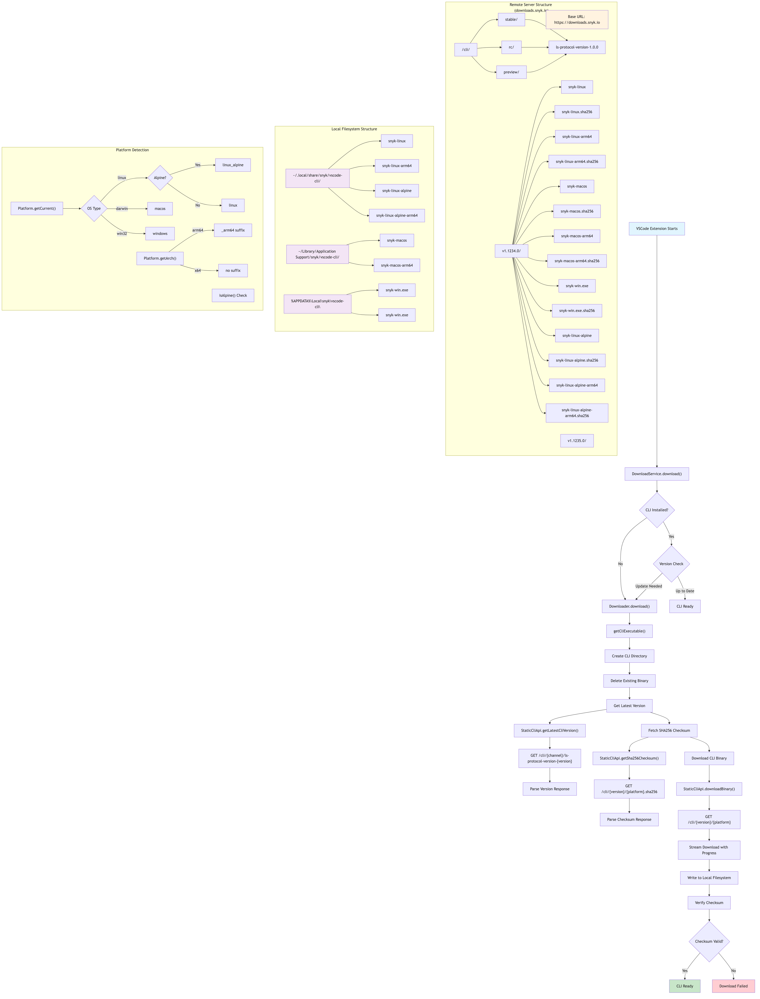

# Snyk CLI Download Logic Documentation

## Overview

This document describes the Snyk CLI download logic implemented in the VSCode extension, including the download flow, server requirements, and local file structure.

## Download Flow

The Snyk CLI download process follows these steps:

1. **Extension Initialization**: When the VSCode extension starts, it checks if the Snyk CLI is installed
2. **Version Check**: Fetches the latest CLI version from the configured release channel
3. **Checksum Fetch**: Downloads the SHA256 checksum for the target platform and version
4. **Binary Download**: Streams the CLI binary with progress tracking
5. **Integrity Verification**: Validates the downloaded binary against the checksum
6. **Installation**: Places the verified binary in the platform-specific directory

## Mermaid Diagram



*The diagram above shows the complete download flow, server structure, local filesystem organization, and platform detection logic for the Snyk CLI download process.*

### Interactive Version

You can also view the interactive Mermaid diagram in the source file: [snyk-cli-download-diagram.mmd](snyk-cli-download-diagram.mmd)

## Server Requirements

### Base URL Configuration
The extension uses a configurable base URL for downloads, defaulting to `https://downloads.snyk.io`.

### Required File Structure
The server must provide the following structure:

```
/cli/
├── {channel}/
│   └── ls-protocol-version-{protocol_version}
├── v{version}/
│   ├── snyk-linux
│   ├── snyk-linux.sha256
│   ├── snyk-linux-arm64
│   ├── snyk-linux-arm64.sha256
│   ├── snyk-linux-alpine
│   ├── snyk-linux-alpine.sha256
│   ├── snyk-linux-alpine-arm64
│   ├── snyk-linux-alpine-arm64.sha256
│   ├── snyk-macos
│   ├── snyk-macos.sha256
│   ├── snyk-macos-arm64
│   ├── snyk-macos-arm64.sha256
│   ├── snyk-win.exe
│   └── snyk-win.exe.sha256
```

### Release Channels
- **stable**: Production releases
- **rc**: Release candidates
- **preview**: Preview/alpha releases

### Version Files
- **ls-protocol-version-{version}**: Contains the latest CLI version for the channel
- **{platform}.sha256**: Contains the SHA256 checksum for the corresponding binary

## Supported Platforms

### Linux Variants
- `snyk-linux`: Standard Linux x64
- `snyk-linux-arm64`: Linux ARM64
- `snyk-linux-alpine`: Alpine Linux x64
- `snyk-linux-alpine-arm64`: Alpine Linux ARM64

### macOS Variants
- `snyk-macos`: macOS x64
- `snyk-macos-arm64`: macOS ARM64 (Apple Silicon)

### Windows Variants
- `snyk-win.exe`: Windows x64
- `snyk-win.exe`: Windows ARM64

## Local Installation Paths

### Linux
```
~/.local/share/snyk/vscode-cli/
├── snyk-linux
├── snyk-linux-arm64
├── snyk-linux-alpine
└── snyk-linux-alpine-arm64
```

### macOS
```
~/Library/Application Support/snyk/vscode-cli/
├── snyk-macos
└── snyk-macos-arm64
```

### Windows
```
%APPDATA%\Local\snyk\vscode-cli\
└── snyk-win.exe
```

## Implementation Details

### Key Classes
- **DownloadService**: Orchestrates the download process
- **Downloader**: Handles binary download and verification
- **StaticCliApi**: Manages server communication
- **CliExecutable**: Represents the installed CLI binary

### Download Process
1. **Version Resolution**: Fetches latest version from channel-specific endpoint
2. **Checksum Fetch**: Downloads SHA256 checksum for integrity verification
3. **Binary Download**: Streams binary with progress tracking and cancellation support
4. **Verification**: Computes local checksum and compares with server checksum
5. **Installation**: Places verified binary in platform-specific directory

### Error Handling
- **Network Failures**: Automatic retry with exponential backoff
- **Checksum Mismatch**: Automatic redownload
- **Cancellation**: Clean cleanup of partial downloads
- **Platform Detection**: Graceful fallback for unsupported platforms

### Configuration Options
- **Base Download URL**: Configurable server endpoint
- **Release Channel**: Selectable release channel (stable/rc/preview)
- **Automatic Updates**: Configurable automatic dependency management
- **Custom CLI Path**: Override default installation location

## Security Considerations

### Integrity Verification
- SHA256 checksums for all binaries
- Automatic verification on download
- Redownload on checksum mismatch

### Proxy Support
- HTTP/HTTPS proxy configuration
- SSL verification settings
- Corporate network compatibility

### Update Strategy
- Version-based update detection
- Automatic update availability checking
- User-controlled update timing
